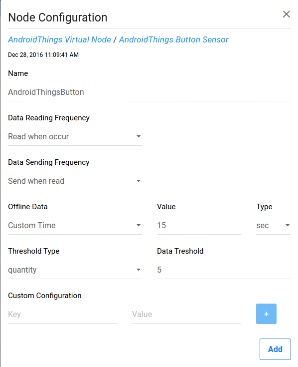
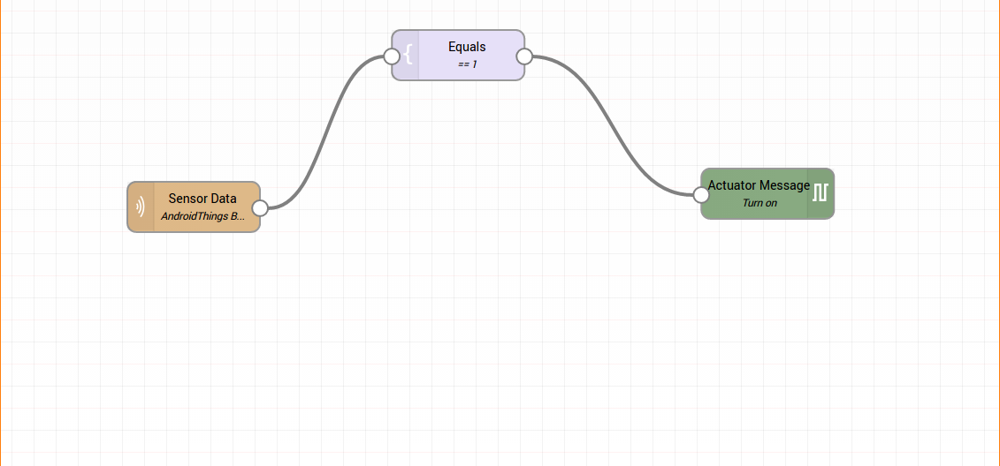

Button and LED sample for Android Things
========================================

This Android Things sample demonstrates how to use a button input
UserDriver to listen to GPIO pin changes, generate and listen for key events
and change the state of an LED accordingly. (NOTICE : In this work, changing the state of LED is not valid anymore if it does not work as IoT-Ignite device rule.)


Pre-requisites
--------------

- Android Things compatible board
- Android Studio 2.2+
- [Rainbow Hat for Android Things](https://shop.pimoroni.com/products/rainbow-hat-for-android-things) or the following individual components:
    - 1 LED
    - 1 push button
    - 2 resistors
    - jumper wires
    - 1 breadboard

Schematics
----------

If you have the Raspberry Pi [Rainbow Hat for Android Things](https://shop.pimoroni.com/products/rainbow-hat-for-android-things), just plug it onto your Raspberry Pi 3.


Build and install
=================

On Android Studio, click on the "Run" button.

If you prefer to run on the command line, type

```bash
./gradlew installDebug
adb shell am start com.example.androidthings.button/.ButtonActivity
```

If you have everything set up correctly, the LED will light up when you press
the button and light off when you release it.


IoT-Ignite Integration
======================

IoT-Ignite is a Platform as a Service (PaaS) distinctively designed for realization of Internet of Things. It provides a secure, reliable gateway connection between your devices and the web and allows you to manage your devices, data flow, data streaming and rule definitions.

In order to connect your hardware or device to IoT-Ignite platform, IoT-Ignite device SDK is used. This work here demonstrates to create an application development using IoT-Ignite SDK. For this purpose, on android studio "repositories" and "dependencies" part under the build.gradle file are created as below;

```
repositories {
 mavenCentral()
 maven {
     url "https://repo.iot-ignite.com/content/repositories/releases"
 }
}

dependencies {
 compile 'com.ardic.android:IoTIgnite:0.7'
 compile 'com.google.code.gson:gson:2.7'
}
```

In addition, below part should be discarded from AndroidManifest.xml file to use Ignite Agent application which  provides connection with Ignite Cloud;

```
<!-- Launch activity automatically on boot -->
    <intent-filter>
          <action android:name="android.intent.action.MAIN"/>
          <category android:name="android.intent.category.IOT_LAUNCHER"/>
          <category android:name="android.intent.category.DEFAULT"/>
    </intent-filter>
```


After making the necessary changes on Android studio, it is time to connect your hardware to IoT-Ignite platform using IoT-Ignite SDK. For this purpose, "IotIgniteHandler.java" class was created. In this class, all the following IoT-Ignite operations were implemented :

- Ignite Manager operation : This Manager class is the entrance point for using IoTIgnite SDK. Without connecting IgniteManager, no operation can be done on IoT-Ignite.

- Node and Things creation and registration : Node is used to manage related things (sensors or actuators). “Things” are the edge devices of IoT-Ignite. In this project, a virtual node is created and "Button" sensor and "LED" actuator are created. (Note : LED is also a sensor in IoT-Ignite).

- Apply configuration to Things and send Things data according to configuration from "Devzone IoT Platform".
Sample Button Configuration Picture :



- Apply actions that are created after Complex Event Processing(CEP) rule : In this project, LED state is again changed by button but it is created as IoT-Ignite device rule.
Sample Device Rule For LED Turn On :




All the necessary comments about these operations are have in the class. For more detail information about above operations, click [IoT-Ignite Manger/Create Node-And-Thing](https://devzone.iot-ignite.com/knowledge-base/iot-ignite-device-api/).

To create IoT-Ignite account check this [devzone-iot-platform](https://devzone.iot-ignite.com/). After creating tenant, you have to download "IoT-Ignite Agent" application and install this application your Raspberry Pi device. Then you start IoT-Ignite application and have to license your device to your account. After that, install this "Button" application on Raspberry Pi device. At the end, do all configuration and CEP rule operaions.


License
-------

Copyright 2016 The Android Open Source Project, Inc.

Licensed to the Apache Software Foundation (ASF) under one or more contributor
license agreements.  See the NOTICE file distributed with this work for
additional information regarding copyright ownership.  The ASF licenses this
file to you under the Apache License, Version 2.0 (the "License"); you may not
use this file except in compliance with the License.  You may obtain a copy of
the License at

  http://www.apache.org/licenses/LICENSE-2.0

Unless required by applicable law or agreed to in writing, software
distributed under the License is distributed on an "AS IS" BASIS, WITHOUT
WARRANTIES OR CONDITIONS OF ANY KIND, either express or implied.  See the
License for the specific language governing permissions and limitations under
the License.
